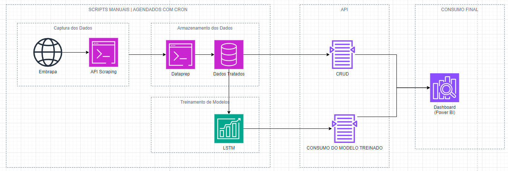

# Tech Challenge 3


## 🧩 Componentes da Solução

A solução é composta por três partes principais:

- Uma **API RESTful** desenvolvida com **FastAPI**, que organiza e expõe os dados em endpoints;
- Um módulo de **coleta automatizada** (`scraper/`), que realiza o scraping diretamente do site da Embrapa e armazena os dados em um banco local.
- Treinamento de um modelo LSTM (Long Short-Term Memory).


 


## 💡 Finalidade

O projeto tem como foco:

- Facilitar o acesso a dados confiáveis do setor vitivinícola;
- Criar uma base sólida para alimentar sistemas de inteligência analítica e modelos preditivos;
- Explorar boas práticas de engenharia de software e arquitetura de APIs em Python.

---

## 📂 Estrutura do Projeto

Esta seção descreve a organização do projeto com base nas **responsabilidades funcionais** de cada módulo, abstraindo detalhes de arquivos individuais. A estrutura foi pensada para garantir **separação de preocupações**, **facilidade de manutenção** e **expansibilidade futura**.

---

### 1. 🧩 Núcleo da Aplicação (`app/`)
Contém toda a lógica da aplicação FastAPI, incluindo controle de rotas, modelos de dados, schemas de validação e lógica de negócio.

#### Submódulos:
- `routers/` → Gerencia os endpoints expostos da API, organizados por domínio (ex: produção, importação, previsão).
- `models/` → Define os modelos de dados que representam tabelas no banco (ORM com SQLAlchemy).
- `schemas/` → Estrutura e valida os dados de entrada e saída da API (Pydantic), além de gerar documentação Swagger automática.
- `database.py` → Responsável por configurar a conexão com o banco de dados e a sessão de uso.
- `main.py` → Ponto de entrada da aplicação (instancia o app e registra os routers).

---

### 2. Módulo de Machine Learning (`app/ml/`)
Responsável por toda a parte de processamento de dados e previsões com modelos de IA.

#### Submódulos:
- `models/` → Armazena os arquivos de modelos treinados (ex: arquivos `.h5` para redes neurais).
- `preprocessing.py` → Contém funções auxiliares para transformar e preparar os dados antes da previsão.
- `services/` → Implementa os serviços de inferência, ou seja, como carregar o modelo e gerar uma previsão com os dados recebidos.

---

### 3. Scripts Auxiliares (`scripts/`)
Utilizado para tarefas administrativas como treinamento, limpeza de dados ou migrações. Não fazem parte do ciclo de vida direto da API, mas são fundamentais para preparação e manutenção.


---

### 4. Documentação (`docs/`)
Contém imagens, diagramas e arquivos auxiliares utilizados na documentação do projeto.

---

### 5. Arquivos de Configuração (nível raiz)
- `.env` → Armazena variáveis sensíveis (opcional).
- `requirements.txt` → Lista de dependências Python.
- `README.md` → Documentação geral do projeto.
- `.venv/` → Ambiente virtual Python (fora do versionamento).

---

### ✅ Benefícios dessa Estrutura

- Organização clara por responsabilidade
- Separação entre API, lógica de negócio e IA/ML
- Fácil manutenção e testes
- Reutilização de componentes
- Aderência a boas práticas de engenharia de software


---

## 🚀 Como Executar o Projeto

Siga os passos abaixo para executar a aplicação localmente, incluindo a coleta e envio dos dados para a API. Lembre-se de que o scraper **não grava direto no banco**, ele envia os dados para a API por meio de requisições HTTP.

### 1. Clone o repositório

```bash
git clone https://github.com/AntonioJCS/fiap_tech_challenge_3.git
cd fiap_tech_challenge_3 # criei ese diretório em algum ponto da maquina
```

### 2. Crie e ative um ambiente virtual

```bash
python -m venv .venv
source .venv/Scripts/activate  # Git Bash no Windows
```

### 3. Instale as dependências

```bash
pip install -r requirements.txt
```

### 4. Inicie a API

Antes de rodar o scraper, é obrigatório iniciar a API, pois ela será responsável por receber e persistir os dados no banco de dados.

```bash
uvicorn app.main:app --reload
```

A API estará disponível em `http://127.0.0.1:8000`

### 5. Autentique-se na API (opcional com Swagger)

Acesse o Swagger em:

[http://localhost:8000/docs](http://localhost:8000/docs)

Use o botão **"Authorize"** e insira:

- **Usuário:** `admin`
- **Senha:** `abc123@abc`

O Swagger armazenará o token JWT automaticamente para requisições futuras.

> ⚠️ Essa etapa é necessária apenas para testar a API manualmente. O scraper já está configurado para autenticar automaticamente.

### 6. Execute o scraper

Com a API rodando, execute o seguinte comando para iniciar a coleta e envio de dados:

```bash
python ingestion/main_scraper.py producao --ano_inicial 1970 --ano_final 2023
```

O scraper irá:
- Coletar os dados da Embrapa via scraping;
- Realizar login na API (programaticamente);
- Enviar os dados por POST para os endpoints correspondentes;
- A API armazenará os dados no banco de dados SQLite (`vitivinicultura.db`).


---

## 🧢 Coleta de Dados com Scraper

O módulo `ingestion/` contém o código responsável por realizar a coleta automatizada de dados da Embrapa e enviá-los para a API, que se encarrega de armazenar as informações no banco de dados.

### ⚙️ Como funciona o scraper

- A coleta é realizada via **web scraping**, utilizando `requests` e `BeautifulSoup`;
- Os dados extraídos são convertidos em objetos Python estruturados;
- O módulo autentica automaticamente na API para obter um token JWT válido;
- Os dados são enviados para os endpoints correspondentes da API utilizando `requests.post()` com o token no cabeçalho;
- A API realiza a validação e grava os dados no banco `vitivinicultura.db`.

### ▶️ Exemplo de execução

```bash
python ingestion/main_scraper.py producao --ano_inicial 1970 --ano_final 2023
```

Esse comando fará a raspagem dos dados de produção vitivinícola entre os anos de 1970 e 2023, e os enviará automaticamente para o endpoint `/producao/` da API.

### 🔒 Autenticação automatizada

Durante a execução, o scraper:
- Realiza login via `/auth/login` com as credenciais padrão (`admin` / `abc123@abc`);
- Recebe o token JWT da API;
- Insere o token nos headers de todas as requisições subsequentes.

### 💡 Observações importantes

- **A API precisa estar em execução** no momento da coleta. Caso contrário, ocorrerá erro de conexão (`ConnectionRefusedError`).
- O scraper atualmente suporta as seguintes entidades: `producao`, `processamento`, `comercializacao`, `importacao`, `exportacao`.
- A arquitetura adotada garante que todas as regras de negócio e validações fiquem centralizadas na API.

---

## 📡 Executando a API

A API foi desenvolvida com **FastAPI** e disponibiliza os dados coletados de forma estruturada por meio de endpoints organizados por domínio (produção, processamento, comercialização etc).

### ▶️ Como iniciar o servidor local

Certifique-se de estar com o ambiente virtual ativado e execute:

```bash
uvicorn app.main:app --reload
```

O parâmetro `--reload` ativa o modo de desenvolvimento, permitindo que a API seja recarregada automaticamente a cada alteração no código.

### 🔎 Acessando a documentação interativa

FastAPI oferece duas interfaces automáticas para explorar os endpoints disponíveis:

- **Swagger UI**: [http://localhost:8000/docs](http://localhost:8000/docs)
- **Redoc**: [http://localhost:8000/redoc](http://localhost:8000/redoc)

### 📦 Organização dos Endpoints

Os endpoints estão organizados por módulo temático, como por exemplo:

- `/producao`
- `/processamento`
- `/comercializacao`
- `/importacao`
- `/exportacao`
- `/previsao`

Cada rota possui métodos HTTP típicos de uma API REST (GET, POST, PUT, DELETE), e os dados retornados estão em formato JSON.

> ✅ Todos os modelos de entrada e saída foram validados com Pydantic, garantindo segurança e integridade dos dados.

---

# 🔐 Autenticação da API

A autenticação da API garante que apenas usuários autorizados possam acessar os recursos disponibilizados pela aplicação. Esta funcionalidade está implementada no módulo `app/auth.py`.

## ⚙️ Visão Geral da Implementação

- A autenticação é baseada em **JWT (JSON Web Tokens)**;
- **Todas as rotas** da API exigem autenticação para serem acessadas;
- O login é realizado por meio do endpoint `/auth/login`, utilizando **usuário e senha**;
- O token JWT gerado é armazenado automaticamente pela interface Swagger UI e utilizado nas requisições subsequentes;
- As rotas são protegidas com o uso de `Depends(get_current_user)`, garantindo que apenas usuários autenticados possam acessá-las.

## 🔑 Credenciais de Acesso (Ambiente Local)

- **Usuário:** `admin`
- **Senha:** `abc123@abc`

Essas credenciais foram configuradas para testes locais e permitem a autenticação completa no ambiente de desenvolvimento.

## 🧪 Como Autenticar Usando o Swagger UI

1. Acesse: [http://localhost:8000/docs](http://localhost:8000/docs)
2. Clique no botão **"Authorize"** no canto superior direito da interface
3. Insira as credenciais solicitadas (usuário e senha)
4. O Swagger irá gerar e armazenar automaticamente o token JWT para uso nas requisições subsequentes

> ℹ️ A autenticação está **ativada por padrão**. Requisições sem autenticação resultam em erro HTTP 401 (Unauthorized).

Esta abordagem garante segurança básica para ambientes de teste e estrutura a base para futuras implementações mais robustas, como controle de permissões por perfil ou autenticação integrada com provedores externos.

---

# 🧹 Endpoints Disponíveis

A API foi estruturada em torno de módulos temáticos que correspondem às principais categorias de dados extraídos da Embrapa. Cada módulo representa uma área da cadeia vitivinícola e está disponível como um conjunto de rotas RESTful.

## 📁 Grupos de Endpoints

Os dados estão organizados e acessíveis por meio dos seguintes caminhos base:

- **`/producao`** – Dados sobre a produção vitivinícola por ano, tipo de uva, estado, entre outros;
- **`/processamento`** – Informações sobre o processamento industrial das uvas;
- **`/comercializacao`** – Dados referentes à comercialização interna dos produtos vitivinícolas;
- **`/importacao`** – Estatísticas sobre a importação de produtos do setor;
- **`/exportacao`** – Dados relacionados à exportação de vinhos e derivados.
- `Previsão` – Endpoint de previsão de produção futura com base em séries temporais usando modelo de IA (LSTM).


Cada rota disponibiliza as operações básicas:
- `GET /` – Listar todos os registros
- `GET /{id}` – Consultar registro por ID
- `POST /` – Inserir novo registro / Fazer um requisição de previsão
- `PUT /{id}` – Atualizar registro existente
- `DELETE /{id}` – Remover registro

> ⚠️ Todas as rotas exigem autenticação JWT válida. Use o Swagger UI para autenticar e testar os endpoints facilmente.

## 🧪 Testando na prática

Ao autenticar-se com sucesso via `/auth/login`, você pode explorar e testar todos os endpoints diretamente na interface:

- [http://localhost:8000/docs](http://localhost:8000/docs)
- [http://localhost:8000/redoc](http://localhost:8000/redoc)

Cada endpoint foi documentado com exemplos de entrada e retorno, permitindo fácil compreensão e validação da estrutura de dados retornada pela API.

---

# 📊 Modelo de Previsão LSTM via API

Como parte do desafio da **Fase 3 do Tech Challenge**, foi incorporado um modelo preditivo de séries temporais utilizando a arquitetura **LSTM (Long Short-Term Memory)** da biblioteca `Keras`.

Esse modelo é exposto via API em um endpoint dedicado, e foi treinado com os dados históricos tratados da produção vitivinícola.

---

## 🌟 Objetivo do Modelo

O modelo tem como propósito prever os valores futuros de produção com base em dados históricos (ano a ano), utilizando séries temporais univariadas.

Isso permite gerar **insights antecipados** para:
- Planejamento da safra
- Logística de armazenamento
- Tomada de decisão estratégica

---

## 🔍 Endpoint da API

- **Rota:** `POST /predict/lstm`
- **Descrição:** Retorna a previsão do próximo valor baseado na sequência informada.
- **Autenticação:** Opcional

### 📂 Corpo da requisição
```json
{
  "valores": [12500.0, 12700.0, 13100.0]
}
```

### 📊 Exemplo de resposta
```json
{
  "prediction": 13350.5
}
```

---

## 🛠️ Como o modelo foi treinado

O modelo foi treinado a partir da base `producoes` após o pré-processamento dos dados.

### Etapas:
1. Extração dos dados da tabela `producoes` (via SQLAlchemy)
2. Agrupamento por ano e somatório da coluna `quantidade`
3. Normalização da série temporal
4. Treinamento com LSTM (camada oculta com 50 neurônios)
5. Salvamento do modelo com `model.save('lstm_model.h5')`
6. Disponibilização do modelo na API usando FastAPI


---
# 📘 Diagramas do Projeto

Para facilitar a compreensão da arquitetura e dos fluxos do sistema, foram desenvolvidos dois diagramas que representam visualmente a estrutura atual e a projeção futura da solução.

## 🧱 Diagrama de Módulos (`modulos.png`)

Este diagrama apresenta a estrutura modular da API, destacando os componentes responsáveis por:

- Coleta e armazenamento dos dados (`scraper/` e `vitivinicultura.db`)
- Organização das funcionalidades por domínio (produção, comercialização, etc.)
- Separação em camadas como `models`, `schemas`, `crud` e `routers`

Essa visualização reforça a adoção de boas práticas de arquitetura, promovendo coesão interna e separação de responsabilidades.

## 🚀 Arquitetura Pós-Fase 1 (`pos_fase1.png`)

Representa a visão de futuro da aplicação, com os seguintes componentes:

- Coleta de dados automatizada e periódica
- Armazenamento estruturado e seguro
- Exposição via API pública (FastAPI)
- Integração com um sistema de frontend para visualização e análise
- Potencial uso da base como fonte de dados para modelos de Machine Learning

> 🖼️ Ambos os diagramas estão localizados na pasta `/docs` do projeto e podem ser usados como material de apoio em apresentações ou documentação técnica.

---

# 🔮 Futuras Melhorias

Embora o projeto esteja funcional e atenda aos requisitos da Fase 1, existem diversas oportunidades para aprimoramento e evolução da solução. Abaixo estão listadas algumas melhorias planejadas ou recomendadas para fases futuras:

## ⚙️ Técnicas e Arquitetura

- Substituição do banco de dados SQLite por uma solução mais robusta como **PostgreSQL** ou **MySQL**, especialmente para ambientes de produção;
- Separação de ambientes de desenvolvimento e produção utilizando arquivos `.env` e configuração dinâmica via `pydantic.BaseSettings`;
- Estruturação de um **pipeline de ingestão automatizado** que execute o scraper periodicamente;
- Implementação de testes automatizados com `pytest` e cobertura mínima de código;
- Adoção de práticas de CI/CD para validação e deploy contínuo da API.

## 🔐 Segurança

- Criação de múltiplos usuários e controle de permissões por perfil;
- Proteção adicional para endpoints sensíveis;
- Integração futura com provedores de autenticação externa (OAuth2, SSO etc.).


## 🌐 Infraestrutura e Interface

- Criação de um frontend (ex: com React ou Streamlit) para visualização dos dados da API;
- Containerização completa com Docker Compose para execução integrada da API, banco de dados e frontend;
- Deploy em nuvem (Heroku, Render, AWS ou GCP) com link público acessível.


